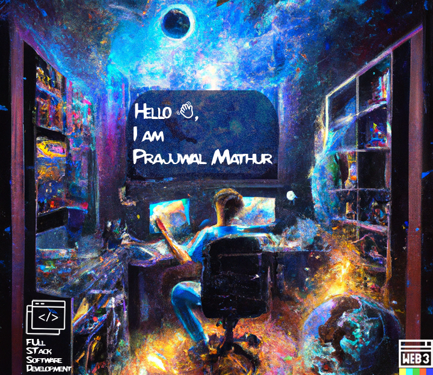

 

<h3> 
    About me
    
</h3>
<ul>
    <li>
        I'm a Programmer, an Open-Source enthusiast, Gamer, and a die-hard F1 fan.🏎️
    </li>
    <li>
        A junior pursuing Electronics and Communication Engineering(ECE).⚡
    </li>
    <li>
        Focussed on DSA and Software Development. 
    </li>
    <li>
        Learning Pattern that I follow: Learning and applying it simultaneously in projects.
    </li>
    <li>
        Looking forward to Software Development opportunitites.✨
    </li>

</ul>

ToolBox🧰

<h4>👉🏽 Languages known</h4>

 
 

<h4>👉🏽 Tools</h4>

 

<h3>Places where I train my DSA skills 🤯</h3>

 

    
Experiences 🧑🏽‍💻

- <a href="https://www.linkedin.com/feed/update/urn:li:activity:6951502813713571840/" style="text-decoration: none">Became a Postman Student Expert: Jul 2022</a>
- Became a member of EddieHub: Jan 2022
- Became a Binance Campus BUIDLer Volunteer: Jan 2022
- Got Selected in AWS Machine Learning Scholarship by Udacity: Oct 2021

Stats 📈

    

